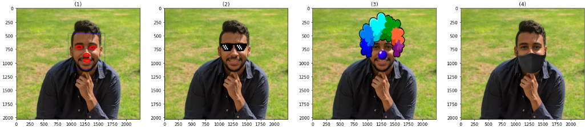

# Face-Cartooniztion

This project is about creating a real time application that applies cartooning filters on faces a similar idea to `snapchat`.

## Used Algorithms:

- Viola-Jones for face detection
- (Average of Synthetic Exact Filters) ASEF Algorithm to detect facial features.
- K-Means for color grouping.

## Used Libraries

> Note: Preferred to use python 3.8 or higher

- scikit-image
- opencv
- matplotlib
- numpy
- imutil
- progress
- tkinter
- scipy.fft
- pickle
- shutil
- PIL
- progress
- collections

## How to Use

To start using the application make sure you have a webcam.

```bash
cd Facial-Feature-Extractor
python main.py
```

### ASEF

To train

```bash
cd Facial-Feature-Extractor
python train.py
```

To test

```bash
cd Facial-Feature-Extractor
python test.py
```

### Viola-Jones

To train

```bash
cd ViolaJones
python train.py
```
 
Testing and results are in main.ipynb

## Results



## Contributors

<a href = "https://github.com/MohamedKamalOthman/Face-Cartooniztion/graphs/contributors">
  
</a>
